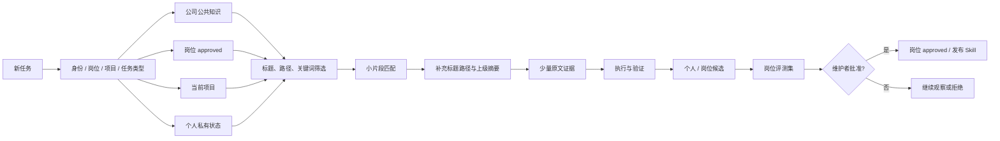

# 机制架构

## 当前已经实现

- 用户级 AGENTS、Hooks、Memories 与本地知识库的零触发加载。
- 小片段命中后补充标题层级和上级摘要。
- 检索器支持由岗位/项目路由器先传入 `allowed_prefixes`，再在限定范围内检索；这是范围路由，不是本期暂缓的公司权限系统。
- `source_id + content_hash` 增量清单、更新/移动/删除/重复识别。
- 产品经理岗位评测集与 Skill candidate/active/deprecated/retired 生命周期。
- GitHub 文件夹作为直接阅读源，ZIP 仅作为下载与安装产物。

## 多人共享原则

同一岗位共用一份岗位 approved，不为每个人复制完整知识库。每个人只增加私人状态空间；新岗位才增加一个岗位目录、配置和评测集。详细规则见 `MULTI-USER-KNOWLEDGE.md`。

## 本期明确不实现

- 不安装 LlamaIndex、向量数据库或 embedding 服务。
- 不实现全公司权限过滤后的混合检索。
- 不自动把周候选发布为公共 Skill。

这些能力等到真实资料规模、漏检案例和权限体系需要时再评估，避免现在增加依赖、Token 与维护成本。
