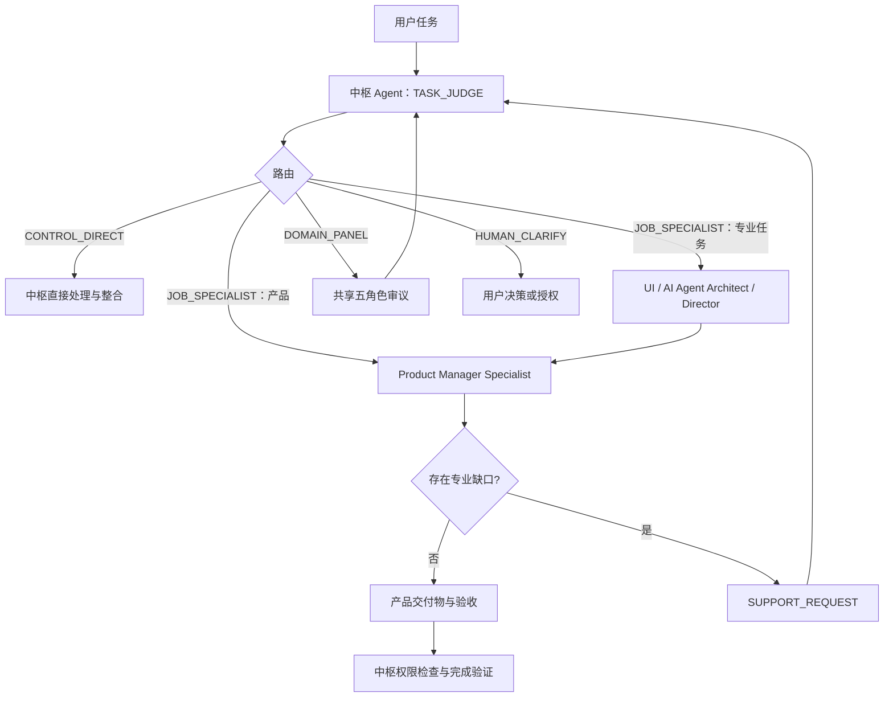

# 0.3.0 机制架构

本包仍是产品经理公共能力包，不是全岗位知识库。新增岗位用于支持产品任务，或承接中枢直接判定的专业任务。

## 责任边界

- 中枢 Agent：保存原始意图、判断主责岗位、检查权限、调度、整合和验收。
- 产品经理：主导产品价值、目标、范围、优先级、交互政策、模型体验与验收。
- UI 设计：负责组件、视觉、设计系统、Figma、无障碍与视觉 QA。
- AI Agent 架构师：负责 Agent、Skill、知识库、记忆、权限、评测、安装和回滚。
- 导演：负责剧本、镜头、叙事、场面调度、连续性和分镜专业判断。
- 共享五角色：只在复杂、高影响或证据冲突时审议，不复制多套面板。

## 知识与成长层

岗位执行仍沿用最小范围检索、父级上下文补全、`source_id + content_hash` 增量去重和岗位回归评测。个人经验先进入候选，维护者确认后才能成为公共能力。

## 本期不包含

- 私人 Vault、个人习惯、聊天记录或公司内部资料。
- Spark、Dashi、Ponytail 等私人实验能力。
- LlamaIndex、向量数据库或公司级权限检索。
- 自动把每周候选发布为公共 Skill。
